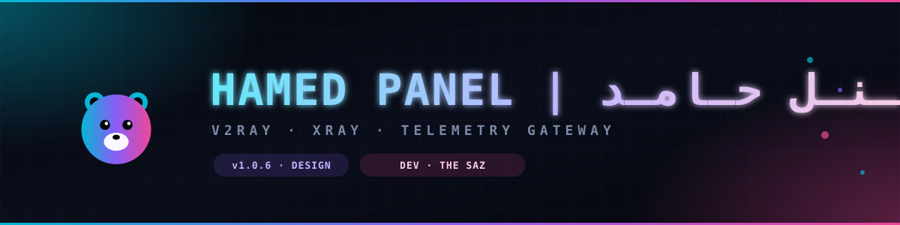

<!-- ============================================================ -->
<!--   README – Hamed Panel v1.0.5 · Silent Edition               -->
<!--   Cloudflare Worker · V2Ray/Xray Management Panel             -->
<!--   Developed by THE SAZ                                        -->
<!-- ============================================================ -->

<p align="center">
  
</p>

<p align="center">
  <a href="https://github.com/hamedp-71/Hamed_Panel/stargazers">
    
  </a>
  <a href="https://github.com/hamedp-71/Hamed_Panel/network/members">
    
  </a>
  <a href="https://github.com/hamedp-71/Hamed_Panel/issues">
    
  </a>
  <a href="https://github.com/hamedp-71/Hamed_Panel/blob/main/LICENSE">
    
  </a>
</p>

<p align="center">
  
  
  
  
</p>

<p align="center">
  
</p>

<p align="center">
  <a href="#-فارسی">🇮🇷 فارسی</a> ·
  <a href="#-english">🇬🇧 English</a> ·
  <a href="docs/">📚 Documentation</a> ·
  <a href="docs/deployment.md">🚀 Deploy</a>
</p>

<p align="center">
  
</p>

<!-- ═══════════════════════════════════════════════════════════ -->
<!--                    فارسی                                     -->
<!-- ═══════════════════════════════════════════════════════════ -->

## 🇮🇷 فارسی

### 🚀 معرفی

**Hamed Panel** یک پنل مدیریت **فوق‌سبک، بدون سرور و هوشمند** برای **V2Ray/Xray** است که به‌طور کامل روی **Cloudflare Workers** اجرا می‌شود. این پنل با تکیه بر زیرساخت جهانی Cloudflare، مدیریت کاربران، رهگیری مصرف، تولید خودکار کانفیگ و تحلیل هوشمند ترافیک را در یک بسته‌ی کاملاً یکپارچه ارائه می‌دهد.

> **هیچ سروری نیاز نیست.** فقط یک کلید Cloudflare Workers و ۵ دقیقه وقت. کل زیرساخت روی شبکه‌ی لبه‌ی جهانی Cloudflare با ۳۰۰+ نقطه‌ی حضور در سراسر جهان اجرا می‌شود.

**نسخه Silent Edition** با تمرکز بر پایداری، خفگی و رعایت اصل **Zero Log** طراحی شده — هیچ درخواستی به سرورهای ثالث ارسال نمی‌شود مگر به‌صراحت توسط شما فعال شود.

---

### ✨ ویژگی‌های کلیدی

<table>
<tr>
<td width="50%" valign="top">

**🧠 هوش مصنوعی و اتوماسیون**
- Workflows با Trigger و Action
- Cron Jobs پیشرفته (۸ نوع تسک)
- Webhooks امضاشده با HMAC-SHA256
- Predictive Analytics (پیش‌بینی مصرف ۷ روزه)
- Smart Suggestions (پیشنهاد هوشمند)
- Detector ناهنجاری (Anomaly)
- Network Weather (وضعیت کلی)

</td>
<td width="50%" valign="top">

**🌐 شبکه و مسیریابی**
- Clean IP Regions با ۹ منطقه آماده
- تست خودکار Clean IP (هر ساعت)
- DNS Pool وزن‌دار با ۵ استراتژی
- Multi-Upstream (زنجیره‌ای)
- NAT64 Auto-Config (MCI/IRANCELL/RIGHTEL/MOKHABERAT)
- DPI Detection (تشخیص حملات DPI)
- Speed Test & Latency Map
- ISP Templates برای ۴ اپراتور ایران

</td>
</tr>
<tr>
<td valign="top">

**🔐 امنیت و مدیریت**
- Session-based Auth (SHA-256)
- Multi-Manager با ۱۴ Permission
- API Keys جداگانه
- IP Auto-Ban
- Rate Limit پیشرفته
- Master Key Authentication
- AES-GCM Encryption برای فیلدهای حساس
- Captcha برای ورود

</td>
<td valign="top">

**📊 تحلیل و گزارش**
- آمار Real-time کاربران
- تاریخچه ۳۰ روزه ترافیک
- نمودارهای Chart.js زنده
- مقایسه کاربران (Compare)
- لاگ‌های دقیق اقدامات
- Export CSV/JSON
- R2 Backup با رمزنگاری
- Telegram Bot یکپارچه

</td>
</tr>
</table>

---

### 🎯 قابلیت‌های پیشرفته

- **تولید خودکار کانفیگ** برای ۶ کلاینت: Xray/V2RayNG، Clash Meta/Mihomo، Sing-Box، Surge، Loon و V2Ray JSON
- **پشتیبانی از Fragment** برای عبور از فیلترینگ (با پریست‌های MCI، Irancell، Rightel، Mokhaberat)
- **توزیع بار روی Relay IPs** با Round-Robin و Auto-Failover
- **تخصیص UUID اختصاصی** برای هر کاربر + Relay (جلوگیری از اشتراک‌گذاری)
- **تشخیص و مسدودسازی خودکار** کاربران پرمصرف
- **پشتیبانی از دو حالت**: VLESS Alpha و Trojan Beta
- **QR Code خودکار** برای هر کاربر

---

### 📦 پیش‌نیازها

| مورد | توضیح |
|-------|--------|
| **Cloudflare Account** | حساب رایگان [cloudflare.com](https://cloudflare.com) |
| **Cloudflare Workers** | پلن رایگان ۱۰۰,۰۰۰ درخواست/روز |
| **D1 Database** | برای ذخیره‌سازی (رایگان تا ۵ گیگ) |
| **KV Namespace** | اختیاری — برای Session سریع‌تر |
| **R2 Bucket** | اختیاری — برای Backup |

> 💡 **رایگان کامل**: با پلن رایگان Cloudflare می‌توانید تا **۱۰۰۰ کاربر فعال** را مدیریت کنید.

---

### ⚡ نصب سریع (۵ دقیقه)

```bash
# 1. کلون ریپازیتوری
git clone https://github.com/hamedp-71/Hamed_Panel.git
cd Hamed_Panel

# 2. نصب Wrangler
npm install -g wrangler

# 3. ورود به Cloudflare
wrangler login

# 4. ساخت D1 Database
wrangler d1 create hamed-panel-db

# 5. ویرایش wrangler.toml و جایگذاری database_id

# 6. استقرار
wrangler deploy
```

پس از استقرار، آدرس Worker خود را باز کنید:
```
https://<your-worker>.<subdomain>.workers.dev/panel
```

**اطلاعات ورود پیش‌فرض:**
- Username: `admin`
- Password: `admin`

> ⚠️ **بلافاصله پس از ورود رمز عبور را تغییر دهید!**

📚 **راهنمای کامل نصب**: [docs/installation.md](docs/installation.md)

---

### 📖 مستندات

| سند | توضیح |
|------|-------|
| [🚀 نصب و راه‌اندازی](docs/installation.md) | گام‌به‌گام نصب روی Cloudflare Workers |
| [🌐 استقرار روی GitHub Pages](docs/deployment.md) | میزبانی مستندات و صفحه فرود |
| [⚙️ پیکربندی پیشرفته](docs/configuration.md) | تنظیمات، Workflows، Cron، Webhooks |
| [📡 API Reference](docs/api-reference.md) | تمام Endpointها با مثال |
| [🔒 امنیت](docs/security.md) | بهترین شیوه‌های امنیتی |
| [❓ پرسش‌های متداول](docs/faq.md) | پاسخ به سؤالات رایج |

---

### 🏗️ معماری

```
┌─────────────────┐
│   User Client   │  (Browser / App)
└────────┬────────┘
         │ HTTPS
         ▼
┌─────────────────────────────────────┐
│  Cloudflare Edge (300+ PoPs)        │
│  ┌───────────────────────────────┐  │
│  │  Worker (V8 Isolate)          │  │
│  │  ├─ /panel    → Dashboard     │  │
│  │  ├─ /sub      → Subscription  │  │
│  │  ├─ /sub/api/* → REST API     │  │
│  │  ├─ /sub/tg   → Telegram Bot  │  │
│  │  └─ WS        → Telemetry     │  │
│  └───────────────┬───────────────┘  │
└──────────────────┼──────────────────┘
                   │
       ┌───────────┼───────────┐
       ▼           ▼           ▼
   ┌───────┐  ┌───────┐  ┌───────┐
   │  D1   │  │  KV   │  │  R2   │
   │ (DB)  │  │(Cache)│  │(Backup)│
   └───────┘  └───────┘  └───────┘
```

---

### 📊 پرفورمنس

| متریک | مقدار |
|--------|-------|
| **Cold Start** | ~5ms |
| **Concurrent Users** | ۱۰,۰۰۰+ |
| **Throughput** | ~۳۰۰۰ req/s (per PoP) |
| **Bundle Size** | ~۱۸۰KB (minified) |
| **Memory Usage** | <۱۲۸MB (isolate) |

---

### 🙏 توسعه‌دهنده

<p align="center">
  <a href="https://t.me/the_saz">
    
  </a>
  <a href="https://zaya.io/thesaz">
    
  </a>
  <a href="https://github.com/THE-SAZ">
    
  </a>
</p>

> **طراح و توسعه‌دهنده انحصاری**: **THE SAZ**
> تمام کدها، طراحی معماری، سیستم امنیت، رابط کاربری و مستندات توسط **THE SAZ** به‌تنهایی طراحی و پیاده‌سازی شده است.

**راه‌های ارتباطی رسمی:**
- 📱 تلگرام: [t.me/the_saz](https://t.me/the_saz)
- 🌐 وب‌سایت: [zaya.io/thesaz](https://zaya.io/thesaz)

---

### 📄 مجوز

این پروژه تحت مجوز **MIT** منتشر شده است — استفاده، تغییر و توزیع آزاد، به شرط ذکر منبع.

---

<!-- ═══════════════════════════════════════════════════════════ -->
<!--                    English                                   -->
<!-- ═══════════════════════════════════════════════════════════ -->

## 🇬🇧 English

### 🚀 Introduction

**Hamed Panel** is an **ultra-lightweight, serverless, AI-powered** management panel for **V2Ray/Xray**, running entirely on **Cloudflare Workers**. Leveraging Cloudflare's global edge network, it delivers user management, traffic analytics, automatic config generation, and intelligent traffic analysis in a single, unified package.

> **Zero servers required.** Just a Cloudflare Workers account and 5 minutes. The entire infrastructure runs on Cloudflare's edge network with 300+ PoPs worldwide.

The **Silent Edition** focuses on stability, stealth, and a strict **Zero Log** principle — no third-party requests are made unless explicitly enabled by you.

---

### ✨ Key Features

<table>
<tr>
<td width="50%" valign="top">

**🧠 AI & Automation**
- Workflows with Triggers & Actions
- Advanced Cron Jobs (8 task types)
- HMAC-SHA256 signed Webhooks
- Predictive Analytics (7-day forecast)
- Smart Suggestions engine
- Anomaly Detection
- Network Weather dashboard

</td>
<td width="50%" valign="top">

**🌐 Network & Routing**
- Clean IP Regions (9 presets)
- Auto Clean IP Testing (hourly)
- Weighted DNS Pool (5 strategies)
- Multi-Upstream chaining
- NAT64 Auto-Config (MCI/IRANCELL/RIGHTEL/MOKHABERAT)
- DPI Detection
- Speed Test & Latency Map
- ISP Templates for Iranian carriers

</td>
</tr>
<tr>
<td valign="top">

**🔐 Security & Management**
- Session-based Auth (SHA-256)
- Multi-Manager with 14 Permissions
- Dedicated API Keys
- IP Auto-Ban
- Advanced Rate Limiting
- Master Key Authentication
- AES-GCM Field Encryption
- Login Captcha

</td>
<td valign="top">

**📊 Analytics & Reporting**
- Real-time user statistics
- 30-day traffic history
- Live Chart.js dashboards
- User comparison
- Detailed action logs
- CSV/JSON export
- R2 Backup with encryption
- Integrated Telegram Bot

</td>
</tr>
</table>

---

### 🎯 Advanced Capabilities

- **Auto-generate configs** for 6 clients: Xray/V2RayNG, Clash Meta/Mihomo, Sing-Box, Surge, Loon, V2Ray JSON
- **Fragment support** for DPI bypass (with MCI/Irancell/Rightel/Mokhaberat presets)
- **Load balancing** across Relay IPs with Round-Robin & Auto-Failover
- **Per-user unique UUIDs** + Relay assignment (prevents credential sharing)
- **Auto-block** high-usage users
- **Dual-mode support**: VLESS Alpha & Trojan Beta
- **Auto QR Code** per user

---

### 📦 Requirements

| Item | Description |
|------|-------------|
| **Cloudflare Account** | Free account at [cloudflare.com](https://cloudflare.com) |
| **Cloudflare Workers** | Free tier: 100,000 requests/day |
| **D1 Database** | For persistence (free up to 5 GB) |
| **KV Namespace** | Optional — faster sessions |
| **R2 Bucket** | Optional — for backups |

> 💡 **Completely Free**: With Cloudflare's free tier, you can manage up to **1,000 active users**.

---

### ⚡ Quick Install (5 min)

```bash
# 1. Clone the repository
git clone https://github.com/hamedp-71/Hamed_Panel.git
cd Hamed_Panel

# 2. Install Wrangler
npm install -g wrangler

# 3. Login to Cloudflare
wrangler login

# 4. Create D1 Database
wrangler d1 create hamed-panel-db

# 5. Edit wrangler.toml and insert your database_id

# 6. Deploy
wrangler deploy
```

Once deployed, open your Worker URL:
```
https://<your-worker>.<subdomain>.workers.dev/panel
```

**Default credentials:**
- Username: `admin`
- Password: `admin`

> ⚠️ **Change the password immediately after first login!**

📚 **Full setup guide**: [docs/installation.md](docs/installation.md)

---

### 📖 Documentation

| Document | Description |
|----------|-------------|
| [🚀 Installation](docs/installation.md) | Step-by-step deployment on Cloudflare Workers |
| [🌐 Deploy to GitHub Pages](docs/deployment.md) | Host docs and landing page |
| [⚙️ Advanced Configuration](docs/configuration.md) | Settings, Workflows, Cron, Webhooks |
| [📡 API Reference](docs/api-reference.md) | All endpoints with examples |
| [🔒 Security](docs/security.md) | Security best practices |
| [❓ FAQ](docs/faq.md) | Frequently asked questions |

---

### 🏗️ Architecture

```
┌─────────────────┐
│   User Client   │  (Browser / App)
└────────┬────────┘
         │ HTTPS
         ▼
┌─────────────────────────────────────┐
│  Cloudflare Edge (300+ PoPs)        │
│  ┌───────────────────────────────┐  │
│  │  Worker (V8 Isolate)          │  │
│  │  ├─ /panel    → Dashboard     │  │
│  │  ├─ /sub      → Subscription  │  │
│  │  ├─ /sub/api/* → REST API     │  │
│  │  ├─ /sub/tg   → Telegram Bot  │  │
│  │  └─ WS        → Telemetry     │  │
│  └───────────────┬───────────────┘  │
└──────────────────┼──────────────────┘
                   │
       ┌───────────┼───────────┐
       ▼           ▼           ▼
   ┌───────┐  ┌───────┐  ┌───────┐
   │  D1   │  │  KV   │  │  R2   │
   │ (DB)  │  │(Cache)│  │(Backup)│
   └───────┘  └───────┘  └───────┘
```

---

### 📊 Performance

| Metric | Value |
|--------|-------|
| **Cold Start** | ~5ms |
| **Concurrent Users** | 10,000+ |
| **Throughput** | ~3,000 req/s (per PoP) |
| **Bundle Size** | ~180KB (minified) |
| **Memory Usage** | <128MB (isolate) |

---

### 🙏 Developer

<p align="center">
  <a href="https://t.me/the_saz">
    
  </a>
  <a href="https://zaya.io/thesaz">
    
  </a>
  <a href="https://github.com/THE-SAZ">
    
  </a>
</p>

> **Sole Designer & Developer**: **THE SAZ**
> All code, architecture, security systems, UI, and documentation are solely designed and implemented by **THE SAZ**.

**Official Channels:**
- 📱 Telegram: [t.me/the_saz](https://t.me/the_saz)
- 🌐 Website: [zaya.io/thesaz](https://zaya.io/thesaz)

---

### 📄 License

This project is released under the **MIT License** — free to use, modify, and distribute with attribution.

<p align="center">
  
</p>

---
